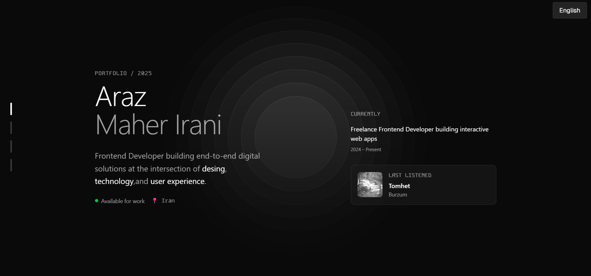

# Araz Maher – Minimalistic Portfolio

<a href="https://gokimax.dev">
  
</a>

The code behind my personal site. :)


## 🚀 Features

- ✨ **Modern Next.js 15** app with [Turbopack](https://turbo.build/pack) for fast development
- 🎨 [ShadCN UI](https://ui.shadcn.com) components and [TailwindCSS](https://tailwindcss.com) styling
- 🎵 Spotify "Now Playing" integration via [Spotify API](https://developer.spotify.com)
- 📝 Markdown-powered blog with code highlighting and copy buttons
- 🗂️ Dynamic project showcase from [`config.json`](config.json)
- 🌗 Light/Dark theme toggle
- 🐳 Docker & Docker Compose support for easy deployment
- ⚡ Animations with [motion](https://motion.dev/)
- 📱 Responsive design

## 🛠️ Getting Started

### Prerequisites

- Node.js 20+
- Yarn, npm, or pnpm
- [Spotify API credentials](https://developer.spotify.com/documentation/web-api/tutorials/getting-started)

### Installation

```sh
git clone https://github.com/ArazMaher/portfolio.git
cd minimalistic-portfolio
npm install
```

### Development

```sh
npm run dev
```

Open [http://localhost:3000](http://localhost:3000) in your browser.

### Build for Production

```sh
npm run build
npm start
```

### Docker

Build and run with Docker Compose:

```sh
docker-compose up -d --build
```

## 📦 Project Structure

```
app/                # Next.js app directory
components/         # UI and section components
content/            # Markdown blog posts
lib/                # Utility functions
public/             # Static assets
config.json         # Project showcase data
```

## 🧩 Powered By

- [ShadCN Ui](https://ui.shadcn.com)
- [NextJS](https://nextjs.org/)
- [Spotify API](https://developer.spotify.com)
- [TailwindCSS](https://tailwindcss.com)
- [motion.dev](https://motion.dev)

---

> Built with ♥️ by Araz